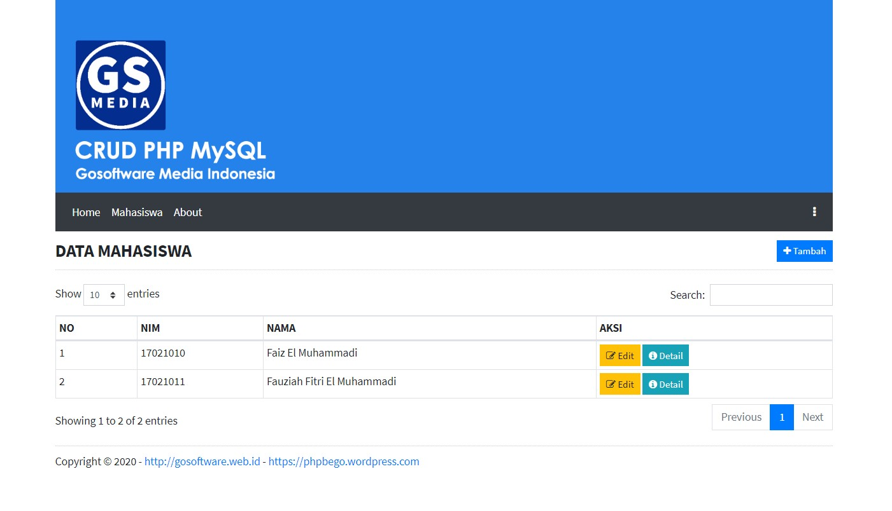

# CRUD PHP MySQL
Create Read Update and Delete with PHP using PDO and Database MySQL

## Update
1. Composer Ready
2. OOP Ready
3. Simple Router
4. Bootstrap 4.4.1
5. DataTables 1.10.18
6. jQuery v3.4.1
7. Font Awesome 4.7.0

## Installation
```sh
git clone https://github.com/suendri/free-crud-php-mysql.git
setting DATABASE app/Controller.php
install DATABASE db/
```
## Donation
Please read DONASI.txt

